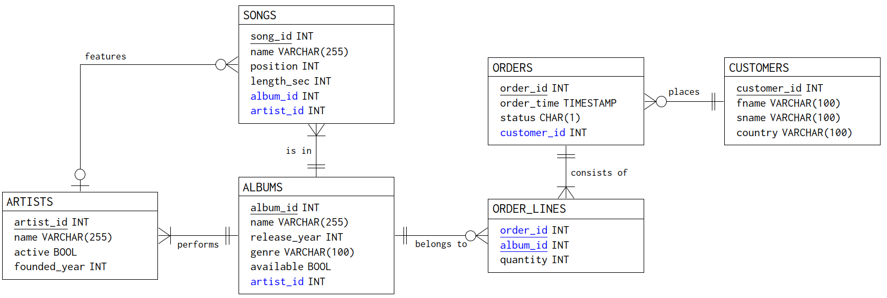

# Description

This repository contains a relational database (structure, data) that is engaging for novices [1].

# Setup with PostgreSQL

There are two alternative ways to set up the database with PostgreSQL. You can either generate the data using database_generate.sql or insert the data using database_inserts_postgresql.sql. The main difference between the approaches is that generation both contains some randomization on the values as well as in the number of generated rows, and it generates data that is dynamic (e.g., orders are made up to the time when the database is generated). With inserts, the database is simply a static collection of data.

## Option 1: Generate the data

- Install PostgreSQL. The database has been tested with PostgreSQL 14.2.
- Download the database_generate.sql file.
- Create an empty database, appropriate users and permission if necessary. Alternatively, you can just use the postgres superuser to test the database.
- Create the database with PostgreSQL's \i command using the psql shell:

`=> \i database_generate.sql`

- If necessary, you may provide an absolute path for \i, e.g.:

`=> \i /home/user/database_generate.sql`

- The following command lists the names of the tables once the database is generated:

`=> \dt`

## Option 2: Insert the data

- Install PostgreSQL. The database has been tested with PostgreSQL 14.2.
- Download the database_inserts_postgresql.sql file.
- Create an empty database, appropriate users and permission if necessary. Alternatively, you can just use the postgres superuser to test the database.
- Create the database with PostgreSQL's \i command using the psql shell:

`=> \i database_inserts_postgresql.sql`

- If necessary, you may provide an absolute path for \i, e.g.:

`=> \i /home/user/database_inserts_postgresql.sql`

- The following command lists the names of the tables once the database is created:

`=> \dt`

# Setup with MariaDB

- Install MariaDB. The database has been tested with MariaDB 9.1.
- Download the database_inserts_mariadb.sql file.
- Create an empty database, appropriate users and permission if necessary.
- Create the database with MariaDB's source command using the mysql shell and absolute path:

`> source /home/user/database_inserts_mariadb.sql`

- The following command lists the names of the tables once the database is created:

`> SHOW TABLES;`

# Thanks

Artist and song names: https://github.com/fivethirtyeight/data/tree/master/classic-rock

# References

[1] Taipalus, T., Miedema, D. & Aivaloglou, F. (2023). Engaging databases for data systems education. To appear in Proceedings of the 28th ACM Conference on Innovation and Technology in Computer Science Education (ITiCSE '23).